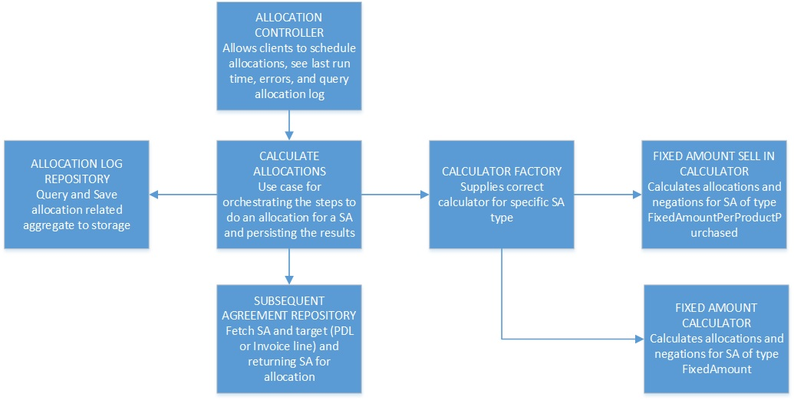

In this post I will explore the way we think about, document, and design systems; taking a brief tour through history on this topic and pose a question about whether we are doing it in a way that makes sense. This question brings up something I have started calling *the functional-structural impedance mismatch*. I will go through a real world experience of how we 
<!--more-->

## A quick look at history

In the 1950s well defined function model diagrams started being used in *systems engineering*, evolving from business process diagrams developed and used in the previous century. In the 1960s these were used by NASA to visualize the time sequence fo space missions and from there they developed into various usages in software development. See the resources at the end if you are interested in the details of this progression but I will move forward quickly here. By the 1990s object-oriented programming started gathering more widespread popularity, exploding when Java arrived on the scene. With it grew the popularity of UML and in particular the structural diagrams that describe how we build our OO systems. I remember many weeks drawing both behavioral and structural diagrams for my university projects in the early 90s and since then class diagrams have served as the staple for most diagrams I see for how software is built.

Why is this important? I think it is influential in why almost any diagram on how to build, or how a system is built, is a structural diagram describing state. The type of diagram is not a problem in and of itself. Diagramming the structure of an application is important. I myself am a big fan of the low ceremony, high contextual information of [Simon Brown's C4 model](https://c4model.com/). State with behavior is how OOP developers think about software, and so is how we document.

## Describing behavior

Regardless of what discipline you come from, most people can gain a fair amount of information from a well drawn flow chart. Flow charts are pretty great behavioral diagrams that tell you how a system accomplishes something, regardless of whether that system is physical or digital. What is great about these kind of diagrams is that they give you an indication of how a system accomplishes something *through time*. They are very intuitive for us to understand how a system behaves. And if you think about it, understanding how a system behaves (or should behave) is one of the most important things we as a developer need to know to maintain and enhance a software system.

Above is an excerpt from a simple flow chart describing the process of calculating the value of an agreement based on sales depending on the type of the agreement.

## A state based structure

So let us take a look at what this flow diagram typically translates to when built by object-oriented programmers that are accustomed to modelling state.

> This is a simplified diagram of a real application I worked on. This is by no means me shitting on how something was built. There are always opportunities to learn how to improve things. This one was unique as we took the time to refactor it (as we will see in a bit).

<!-- 
 -->

I think the resulting structure of the important classes are quite standard. I also do not think that it is crystal clear how and where this relates to the process. It is not too hard to guess because this has been simplified and this is a pretty small system. When digging into this system though is was already difficult to reason about where what is done.

## A functional structure

So the team agreed we need to try improve the structure of the existing code. Over the next couple weeks the system was refactored structurally to look like this:

As you can see, visually this is far more in line with the functional flow diagram. This really did improve the team's ability to reason about the code, especially for new team members joining after development had progressed quite far.

Here is what some of the newer developers on the team had to say:

> Quote 1

> Quote 2

## Discussion

## Resources

1. [Function model](https://en.wikipedia.org/wiki/Function_model)