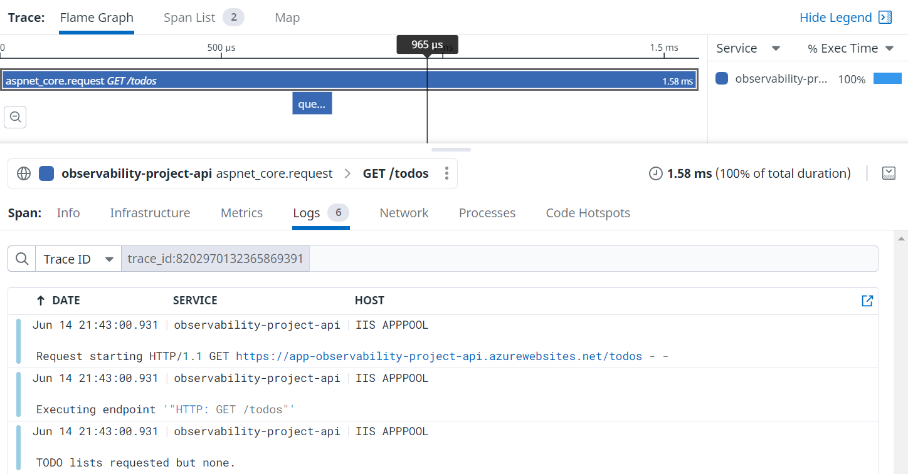

When getting started with a new telemetry platform you may not know what conventions you need to set and follow. Even if you do, how do you get the rest of the team to follow them too. In this post I will give some tips for making sure the data hitting your telemetry tool is clean and organised so you can make the most of it, while not compromising the readability of your application code.
<!--more-->
## Define metric and tagging conventions early

Anyone who has used a telemetry tool like Datadog in an organisation where the conventions are not clear will recognise the problem this is trying to solve. As teams start sending data, searching for anything becomes difficult as you sort through metrics ranging from `AcmeCoolServiceStartedUp` to `record_updated`. This can quickly get out of hand and can make searching for metrics quite frustrating. Since we want to make working with telemetry as [easy as possible], I suggest you tackle this as soon as possible.

Here are some of my recommendations:

- Use lowercase `snake_case` for metrics and and lowercase `kebab-case` tags. Reasons: Avoid case sensitive search issues. Readability.
- Consider namespacing your metrics if you foresee multiple complex domains with lots of unique metrics eg. `some_domain.some_app_some_metric`
- Make use of key-value pairs in tags eg. `env:prod`
- Be clear on reserved tags eg. `env:prod` and `service:app-name`
- Use `result:success` and `result:fail` tags on the same metric rather than 2 separate metrics

When running in the cloud, like many are, an important part of tagging that is easy to overlook is your infrastructure tagging. A system like [Datadog](https://docs.datadoghq.com/) will pull tags from your cloud infrastructure resources and attach them to the metrics sent from that resource. This is why it is important to match your metric tagging and cloud infrastructure tagging conventions.

Infrastructure tags to consider:

- The environment as an `env` tag
- The `service` sending telemetry
- You may want one or more of the following: `cost-centre` / `department` / `domain`
- The team to contact for support with the resource `team:team-name`
- The SLA for the application
- The criticality of the application for the health of your system ranging from `criticality:very-high` to `criticality:low`
- The tool used to created eg. `tool:farmer`
- Dates like `created-at:2022-05-22` and `updated-at:2022-05-30`

This is not an exhaustive list but will hopefully give you a starting point.

## Build up tooling to help with standards

Tooling for helping developers fall into the pit of success with the configuration and tagging of metrics can go a long way.

One such example is a thin wrapper around application setup that enforces the setup and sending of a service name, environment, etc. Often these things can be handled by the host environment but if not it is worth the small effort.

Rather than having each new project require configuring the application telemetry just right, make some sort of template, snippet, or package available to help developers fall into the pit of success.

```csharp
// ASP.NET Program.cs
var builder = WebApplication.CreateBuilder(args);
builder.AddTelemetry();
// other setup...
```

The example above relies on environment variables being present but your solution could require they are passed in. The important part is making it easy to do right and provide clear guidance if something is wrong. For example, the `AddTelemetry` method will explicitly check that all expected environment variables are present and throw an error with a clear list of all missing environment variable names.

```csharp
missing.EnvVarCheck("DD_API_KEY", "Set `DD_API_KEY` with your Datadog API key.");
missing.EnvVarCheck("DD_ENV", "Set `DD_ENV` with the name of the current environment eg. prod");
missing.EnvVarCheck("DD_SERVICE", "Set `DD_SERVICE` with the name of this service.");
// etc.
```

The important takeaway is to make it easy to setup correctly, and give clear feedback when something is wrong.

The next helper that you can introduce is some way to make metric names discoverable.

```csharp
public static class MetricName
{
    public const string TodoListCreated = "observability_project.todo.list_created";
    public const string TodoListCount = "observability_project.todo.list_count";
}
```

This may seem like a chore but it does have some advantages. You now have a repeatable way for developers to find a metric name via intellisense. You have a single place to change a metric name if you really needed to. And an often overlooked benefit is you have an overview of all metrics possibly sent and an IDE enabled way to find from where.

The same arguments can be made for tags. Remember that tags should always be of a fixed set, and so capturing them in code should be possible. If you are using an almost unconstrained range like a database identifier as a tag, expect a large bill from your telemetry provider for excessive indexes. Having them easily discoverable means you don't have multiple tags used for the same thing eg. `result:fail`, `result:failure`, and `result:error`.

```csharp
public static class Tag
{
    public const string Success = "result:success";
    public const string Failure = "result:failure";
}
```

If you decide not to go with a static list like above, at least introduce some kind of check that helps point out poorly conforming metrics and tags.

## Enable metric and log correlation

The true power of modern telemetry solutions is in the correlation of traces and logs through identifiers that allow correlation between parent and child processes, even across network boundaries. Hopefully most of you would have seen this in action already but if not, it unlocks another level of observability in your applications.



Above you can see we not only have a nice trace representing our request, we also all the logs linked to said request through the trace. It can often be some work to make sure these trace and span identifiers are flowing through your system well but when they are it is magic.

## Don't mix telemetry code and application code

Instead of littering your code with random logs and metric pushes, I suggest starting with "what happened?". Once you have a call defining what happened, you decide what telemetry to send internally. This is better explained with an example:

```csharp
DogStatsd.Set("observability_project.todo.list_count", dataStore.Count);
if (dataStore.Count == 0)
{
    logger.LogInformation("TODO lists requested but none.");
    return (new List<TodoList>());
}
return dataStore.Values.ToList();
```

In the snippet above we we have metric and logging code scattered around our application code. This can be better refactored into calls to a telemetry calls saying what happened, and we place the metric sending and logging within.

```csharp
if (dataStore.Count == 0)
{
    telemetryEvents.NoListsReturned();
    return (new List<TodoList>());
}
telemetryEvents.ListsAvailable(dataStore.Count);
return dataStore.Values.ToList();
```

A complaint I have heard a few times with this approach is that logging and metrics are not the same so they shouldn't be bundled together this way. There are a few arguments to make here but instead I will ask a few questions. Is the code clearer because of this change? Will the core application logic change less frequently for unrelated reasons like adding a log?
```

If you are interested, an old colleague, [Erik Heemskerk wrote this up in more detail].

## Instrument where the action happens

This is more a rule of thumb (no Sopranos here so no fingers will be broken if you ignore it). My suggestion is to try and keep the sending of telemetry to the boundaries of your application. Place them where calls come into your application and where calls go out to databases or other network calls.

What you want to try do is keep them out of your core domain calculations. Sometimes, if your domain is complex enough it may be worth the odd call to that logs some information. Mostly though, metrics are about something happened, and it didn't really happen until your application interacts with the outside world.

## Conclusion

I touched on a few ways you can set a team up for success when using a telemetry tool. There are plenty of things to learn and maybe I will do more posts on the subject. Good luck on your telemetry journey. Feel free to hit me up on [Twitter](https://twitter.com/DevonBurriss) with your tips.