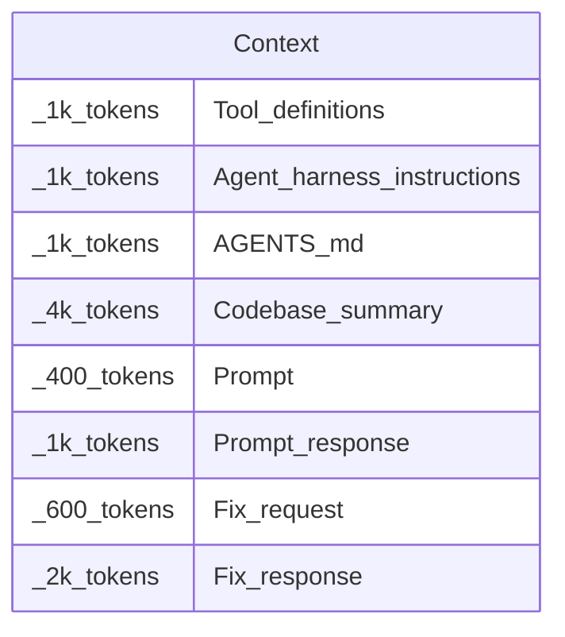

The Context is the input that is passed to the [[LLM|Model]] for probabilistic completion. This is passed in as a sequence of tokens and then tokens are generated based on a probabilistic distribution as an output.
Order matters since preceding tokens in the context influence the tokens that are produced.

Each [[LLM|Model]] has a fixed [[Context|Context Window]] size for both input and output. Anything falling outside the maximum allowed tokens is either ignored or dropped.

It is important to remember that an [[LLM]] has no memory. It is stateless. So everything that is needed for the next projection is passed in via the context every time. This includes system instructions, tool and [[MCP]] definitions, any included context from files or a repository, and of course the user [[Prompt]]. This must all fall within the context window.

Example allocations of what might be in the context:

[[AI Agents]] often use a technique called [[Context Compaction]] to manage the size of the context. Modern [[LLM|Model]] context window sizes can be over a million tokens but their effectiveness drops off far sooner than that. This is often called [[Context Rot]] and is a core consideration in [[Context Engineering]].

## Resources
- [What is a context window](https://www.youtube.com/watch?v=-QVoIxEpFkM&t=2s)
- [Tokens and context windows](https://www.geeksforgeeks.org/artificial-intelligence/tokens-and-context-windows-in-llms/)
