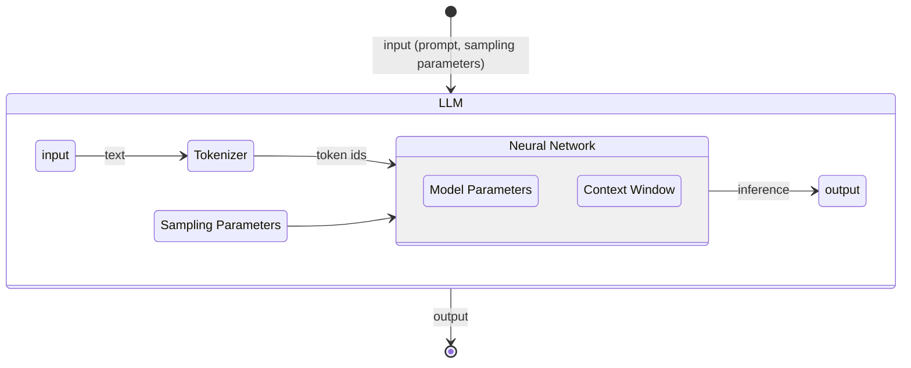

A Large language model (or just model) is a [[Neural Network]] trained on a large corpus of text to predict the next [[Token]], based on the previous tokens in the input.

The LLM functions like a probabilistic [[Pure Function]] that predicts the response based on the input and [[Sampling Parameters]]. Good to note that an [[Agent Harness]] can add [[Tool Calling]] and no control over the seed, meaning that in practice these do not resemble a pure function.

This new family of large language models represent a key new capability that we have access to programmatically, namely the generation and "understanding of" text.

This input is known as the [[Context|Context]] and has a fixed size known as the [[Context|Context Window]]. This size is the maximum size of the input, over that will be truncated, ignored, or rejected. Since performance drops off way before this maximum size, [[Context Engineering|Context Engineering]] has emerged as a core skill in working with [[Agentic workflows]].

It is important to understand that LLMs do not contain the original training data, or even a summary of it. What they use to predict the next token are [[Model Weights]], often also called [[Model Weights|Model Parameters]]. These are matrices of floating point numbers that encode the patterns in text, not actual summaries of the data. Also important for the model is that the training data has a cutoff date, after which nothing of that data is encoded. The training does of course generalise, and the factual information always needs checking, since it is using inference, not recall.

Lastly on the topic of parameters, the effectiveness of a model is largely a function of the size and quality of the data it was trained on, although [[Fine tuning]] can have a large effect on it's behaviour.

Examples:

| Model                           | Context Window       | Output Tokens (approx) | Parameters (weights)       | Estimated Training Tokens*         | Input Cost / 1M tokens | Output Cost / 1M tokens |
| ------------------------------- | -------------------- | ---------------------- | -------------------------- | ---------------------------------- | ---------------------- | ----------------------- |
| **GPT-4o (OpenAI)**             | 128 K tokens         | ~16 K                  | _Not public_               | _Not public_                       | ~$2.50–$5              | ~$10–$20                |
| **GPT-5 (OpenAI)**              | ~128 K (typical API) | ~16 K                  | _Not public_               | _Not public_                       | ~$1.25                 | ~$10                    |
| **Anthropic Claude 3.7 Sonnet** | 200 K                | ~128 K                 | _Not public_               | _Not public_                       | ~$3.00                 | ~$15                    |
| **Anthropic Claude 3 Opus**     | 200 K                | ~128 K                 | _Not public_               | _Not public_                       | ~$15.00                | ~$75                    |
| **Google Gemini 2.5 Pro**       | ~1 M tokens          | ~8 K                   | _Not public_               | _Not public_                       | ~$1.25–$2.50           | ~$10–$15                |
| **Meta LLaMA 3.1 / 3.2 (70B)**  | ~128 K               | ~4 K                   | 70.6 B                     | ~15 T tokens (Llama 3 pretraining) | Free/Open              | Free/Open               |
| **LLaMA 4 Maverick (Meta)**     | ~1 M tokens          | ~8 K                   | ~400 B total (17 B active) | ~30 T+ tokens (est)                | Free/Open              | Free/Open               |
| **Mistral Large**               | ~131 K               | ~4 K                   | ~123 B                     | _Not public_                       | ~$2.00                 | ~$6.00                  |
| **Grok-3 (xAI)**                | ~131 K               | ~8 K                   | ~314 B (Grok-1 base)**     | _Not public_                       | ~$3.00                 | ~$15.00                 |
| **DeepSeek-V3**                 | ~64–128 K            | ~4 K                   | ~671 B                     | ~14.8 T tokens                     | ~$0.27                 | ~$1.10                  |
| **Qwen 3 / Qwen-2.5 (Alibaba)** | ~64–128 K            | ~8 K                   | ~72 B (Qwen-2.5 max)       | ~18 T tokens                       | ~$0.40                 | ~$0.80                  |

## Resources

- [[1hr Talk] Intro to Large Language Models](https://www.youtube.com/watch?v=zjkBMFhNj_g)

