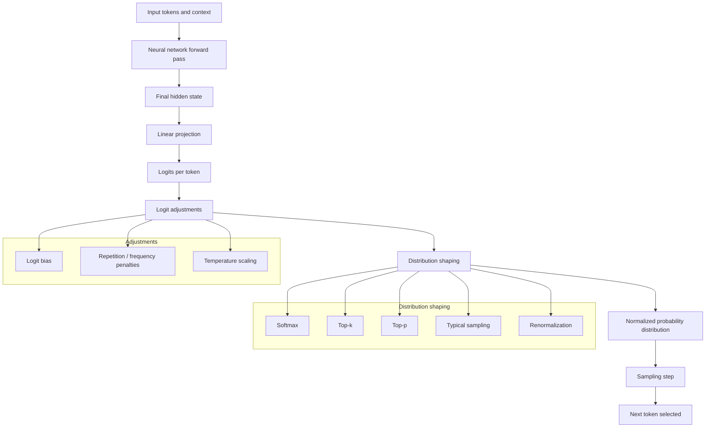

Sampling parameters, also known as Inference Parameters, are a collection of input parameters for completions (inference) that can be used to control the output of a [[LLM]]. 
These parameters affect decoding only and do not change the model’s internal representations or weights.
The sampling parameters operate on the [[Logit]]s that come out of the [[Neural Network]]. These parameters give control over the transformation of logits to probability distributions before the [[Sampling]] into output tokens.

Sampling parameters matter because they control the trade-off between determinism, diversity, and failure modes such as repetition or hallucination, without changing the underlying model.

|Parameter|Common default|What change is applied|When to use|Resulting behavior|
|---|---|---|---|---|
|Temperature|1.0|Divide all logits by T|Control randomness globally|Lower sharpens, higher flattens probability mass|
|Top-k|Disabled or 40|Keep k highest logits, mask rest|Cut off long tail|More focus, possible brittleness|
|Top-p|1.0 or 0.9|Keep tokens until cumulative probability ≥ p|Adaptive truncation|Stable diversity across contexts|
|Min-p|Disabled or 0.05|Drop tokens below fixed probability|Avoid extremely unlikely tokens|Prevents rare noise, risk of collapse|
|Typical sampling|Disabled or 0.2|Penalize entropy outliers|Reduce dull or erratic output|More natural phrasing|
|Repetition penalty|1.0|Scale down logits of repeated tokens|Prevent loops|Less repetition, weaker emphasis|
|Frequency penalty|0.0|Subtract proportional to token count|Reduce word reuse|Increased lexical diversity|
|Presence penalty|0.0|Subtract once if token appeared|Encourage topic shift|More exploration|
|Logit bias|0|Add fixed per-token offsets|Enforce constraints|Hard steering|
|Greedy decoding|Off|Select max logit only|Deterministic tasks|No diversity|
|Beam search|Off or 5 beams|Track top sequences|Structured generation|Higher likelihood, dull text|

## Resources
- https://simonwillison.net/2025/May/4/llm-sampling/
- https://docs.vllm.ai/en/v0.6.0/dev/sampling_params.html
