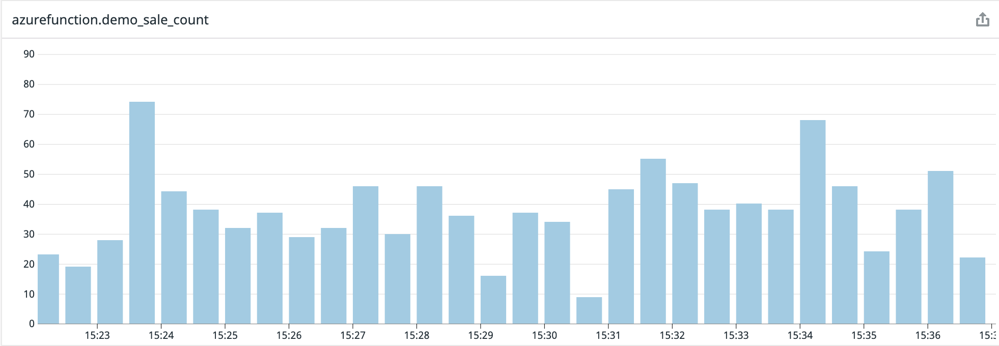

For years now I have noticed a blind-spot when using serverless functions and observability platforms like Datadog. Custom metrics. Observability tools are constantly improving their integrations with cloud providers but are still not on par with having access to the OS like with VMs or containers. In this post I explore a little proof-of-concept I did to get custom metrics out of Azure Functions.
<!--more-->

## How it started

A couple years back I explored solving this with a [custom binding](https://github.com/dburriss/DatadogAzureFunctions) to Datadog but it was a naive implementation that just called Datadog's HTTP API. About a year ago I had the idea of scraping these metrics using Prometheus but at the time I couldn't find a library that easily allowed me to "speak Promethean". The .NET libraries I found didn't seem to allow you to create or parse Prometheus logs, instead handling things from end-to-end. Usually as middleware.

## Clearing the path

So about 7 months back I created a small library called [Fennel](https://github.com/dburriss/fennel) which has a very simple purpose. Parse Prometheus text to objects, and turn these metric objects into valid Prometheus text. This gave me the building block I needed to easily try my experiment.

You can find my [post on Fennel here](/prometheus-parser-fennel).

## Taking the steps


So my idea is fairly simple. In any function that needs to emit metrics, use a Azure Function binding to write them to some store. I chose an Azure Storage Queue for simplicity but I need to post a disclaimer at this point:

> This is demo code hacked together in an evening and does not consider the following very important production quality points:
> 1. Longer persistence of the metrics
> 1. Multiple consumers of the metrics
> 1. Enforcing ordering if more than 1 function instance is running
> 1. Resilience and sending custom metrics only if state has changed
> 1. This ignores a lot of the more complex things Prometheus exporters do
> 
> The code will be available on my [GitHub](https://github.com/dburriss/Fennel.MetricsDemo). 

As a reminder, the Prometheus format is a text based format.

```text
# This is a comment but the following 2 have meaning
# HELP http_requests_total The total number of HTTP requests.
# TYPE http_requests_total counter
http_requests_total{method="post",code="200"} 1027 1395066363000
http_requests_total{method="post",code="400"}    3 1395066363000
```

For this demo I have a small function on a timer trigger to emit metrics.

```fsharp
// The builder ensures that a metric has HELP and TYPE information when written to a string
// For implementation: https://github.com/dburriss/Fennel.MetricsDemo/blob/master/Fennel.MetricsDemo/PrometheusLogBuilder.fs
let metricsBuilder = PrometheusLogBuilder()
                        .Define("sale_count", MetricType.Counter, "Number of sales that have occurred.")

// Function for generating some simple metrics
[<FunctionName("MetricsGenerator")>]
let metricsGenerator([<TimerTrigger("*/6 * * * * *")>]myTimer: TimerInfo, [<Queue("logs")>] queue : ICollector<string>, log: ILogger) =
    let msg = sprintf "Generating sales at: %A" DateTime.Now
    log.LogInformation msg
    let sales = Random().Next(0, 50) |> float
    let metric = Line.metric (MetricName "demo_sale_count") (MetricValue.FloatValue sales) [] (Some(Timestamp DateTimeOffset.UtcNow))

    queue.Add(Line.asString metric)
    log.LogInformation (sprintf "Sales : %f" sales)
```

It places a Prometheus text representation of a `demo_sale_count` event on a queue called `logs`.

Next, I create a HTTP Azure Function to serve as the `/metrics` endpoint to be scraped by Prometheus.  It pulls the messages off the `logs` queue and builds up Prometheus text.

```fsharp
[<FunctionName("metrics")>]
let metrics ([<HttpTrigger(AuthorizationLevel.Anonymous, "get", Route = null)>]req: HttpRequest) (log: ILogger) =
    async {
        log.LogInformation("Fetching prometheus metrics...")
        // setup queue client
        let queueName = "logs"
        let connectionString = Environment.GetEnvironmentVariable("AzureWebJobsStorage", EnvironmentVariableTarget.Process)
        let queueClient = QueueClient(connectionString, queueName)
        
        if queueClient.Exists().Value then
            // receive messages
            let messages = queueClient.ReceiveMessages(Nullable<int>(32), Nullable<TimeSpan>(TimeSpan.FromSeconds(20.))).Value
            log.LogInformation(sprintf "Received %i logs." messages.Length)
            // return message as text
            let processMessage (msg : QueueMessage) =
                let txt = Encoding.UTF8.GetString(Convert.FromBase64String(msg.MessageText))
                queueClient.DeleteMessage(msg.MessageId, msg.PopReceipt) |> ignore
                txt
            let metrics = messages |> Array.map processMessage
            // build up Prometheus text
            let responseTxt = metricsBuilder.Build(metrics)
            
            // return as Prometheus HTTP content
            let response = ContentResult()
            response.Content <- responseTxt
            response.ContentType <- "text/plain; version=0.0.4"
            response.StatusCode <- Nullable<int>(200)
            return response :> IActionResult
        else return NoContentResult() :> IActionResult
        
    } |> Async.StartAsTask
```

Nothing too interesting here other than the `ContentType` being "text/plain; version=0.0.4" as per Prometheus specification.

## How it's going

Having the metrics endpoint up, all that is left is to [setup a local Prometheus instance](/local-prometheus-setup) to call our Azure Function.

Looking at Prometheus' UI at `http://localhost:9090/graph` we can query for `sale_count` and we can see the metrics are coming in:


At work we use Datadog and it turns out the [Datadog agent has support for scraping a Prometheus endpoint](https://www.datadoghq.com/blog/monitor-prometheus-metrics/). Once we have the [Datadog agent setup](/prometheus-datadog-agent) we can see the metrics flowing into Datadog.



## Conclusion

This was a quick proof-of-concept of whether this approach was worth pursuing. I intend to take it further by running this in Azure and have a container with an agent reach out for metrics. It is unfortunate that the workarounds described here are necessary at this point but if we want a view on business metrics, we need to get creative. What I do like about this approach though is that it leverages Azure function bindings as well as Prometheus' scraping model, so not much had to be re-invented here. I am sure in the future we will see better baked in solutions for this but for now we work with what we have.


<span>Photo by <a href="https://unsplash.com/@_ggleee?utm_source=unsplash&amp;utm_medium=referral&amp;utm_content=creditCopyText">Gleb Lukomets</a> on <a href="https://unsplash.com/s/photos/flame?utm_source=unsplash&amp;utm_medium=referral&amp;utm_content=creditCopyText">Unsplash</a></span>
