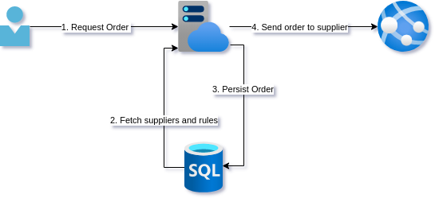
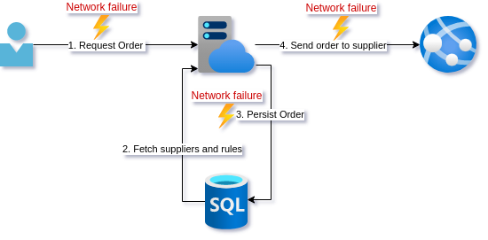
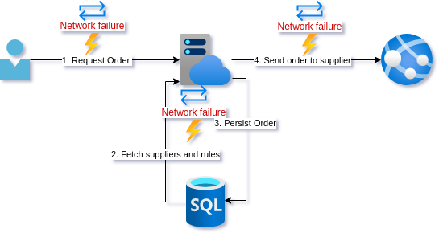

Resiliency is more than just slapping a retry policy on a client and hoping it can handle transient errors. It is building systems that handle operations that always end in a valid state across the whole system. This does not mean that all operations WILL BE successful. Just that they are always handled in an expected way, every time.
<!--more-->
Posts in this series:

1. Exploring reties, retry implications, and the failure modes they are appropriate for
2. [Using Idempotency-Key and a response cache](/reliable-apis-part-2)
3. [The epic saga of client-side IDs and true idempotence](/reliable-apis-part-3)

To explore this, let's step into a young developer's shoes and consider a simple piece of functionality. 

> A stock purchaser is using a system where they look at some analytics on a stock item and decide if they need to purchase more stock and how much. They indicate the quantity on the client application and click the "Order now" button. This sends a POST request to the backend to create an order with the supplier.

## The naive design

For this, you coded up the following. A simple call to a backend API that deserializes the request, checks against some predefined rules and looks up the best supplier, persists the order, and finally sends the purchase order off to the supplier API.

Everything seems to be working well. However, while getting some requirements for a new feature a stock purchaser mentions that sometimes ordering fails. They then click the button again and everything seems to work fine. 

## The naive fix

Looking through some logs you notice some HTTP timeouts. You decide to add retry logic to the client in case that call fails. For good measure, you add retry policies to the database calls as well as the external supplier API call.

After a few days, the stock purchasers report that they are indeed no longer getting the error that requires them to resubmit the order.

*A few weeks later...*

The purchaser contacts you in a panic. The warehouse has reported receiving multiple shipments of the same product, with exactly the same quantity, but as separate shipments. According to the warehouse, this happens now and again but recently the frequency has increased as well as the number of duplicate shipments, with as many as 5 duplicates. 5. Shi!t! that is the exact number as your retry policy!

## Lesson learned

Feeling a bit bad about the trouble you caused for your stakeholder you take a step back and remove the retry policy from the client call and the external supplier API call. You reckon it is safe to leave on the query to get supplier data since that does not change state. The persist seems ok to since the database call succeeds or fails reliably.

Sufficiently chastened by your mistake, you decide to add some metrics and tracing to the operations. On top of that, you add some alerting on top of failed calls to the supplier API. Lastly, you add some exception handling to failed supplier calls so that the entry in the database is removed. For now, you will just let your stakeholder know when this happens so they can reorder.

After a few weeks, it seems your changes are acceptable since this only happens occasionally.

## Analysis

Our young developer learned some important lessons. Let's go over what happened.

Firstly, our young developer fell for the first fallacy of distributed systems, ala *"The network is reliable"*.

In my experience, this is a common one for developers to fall into when they are dealing with low volume traffic. The time between failures is long, and if there is a user observing an intermittent failure, they will often just retry.

Adding a retry policy was a good instinct but unfortunately, it requires your API to have particular characteristics. We will get to these characteristics in later posts but first, let's look at each step in the operation, and what effect a retry has.

[](https://mermaid-js.github.io/mermaid-live-editor/edit/##eyJjb2RlIjoic2VxdWVuY2VEaWFncmFtXG4gICAgbG9vcCAxLiBDbGllbnQgQVBJIGNhbGxcbiAgICAgICAgQ2xpZW50LT4-K0FQSTogQ3JlYXRlIG9yZGVyIHJlcXVlc3RcbiAgICAgICAgXG4gICAgICAgIGxvb3AgMi4gRmV0Y2ggZnJvbSBEQlxuICAgICAgICBBUEktPj5EYXRhYmFzZTogRmV0Y2ggc3VwcGxpZXIgZGF0YVxuICAgICAgICBlbmRcbiAgICAgICAgXG4gICAgICAgIGxvb3AgMy4gUGVyc2lzdCB0byBEXG4gICAgICAgIEFQSS0-PkRhdGFiYXNlOiBQZXJzaXN0IE9yZGVyXG4gICAgICAgIGVuZFxuICAgICAgICBcbiAgICAgICAgbG9vcCA0LiBFeHRlcm5hbCBBUEkgY2FsbFxuICAgICAgICBBUEktLT4-U3VwcGxpZXIgQVBJOiBDcmVhdGUgb3JkZXIgYXQgc3VwcGxpZXJcbiAgICAgICAgZW5kXG5cbiAgICAgICAgQVBJLS0-Pi1DbGllbnQ6IE9yZGVyIGNyZWF0ZWQgcmVzcGmplex9uc2VcbiAgICBlbmQiLCJtZXJtYWlkIjoie1xuICBcInRoZW1lXCI6IFwiZGVmYXVsdFwiXG59IiwidXBkYXRlRWRpdG9yIjpmYWxzZSwiYXV0b1N5bmMiOnRydWUsInVwZGF0ZURpYWdyYW0iOmZhbHNlfQ)

### 1. Client API call

Putting a retry around the entire operation is problematic because our developer friend was not being very specific about what went wrong. As we will see in the next few paragraphs, a retry may be appropriate or not. In part 2 of this series of posts, we will start to make our API endpoint idempotent. As we will see then, even that is more difficult than it seems at first glance. 

What are some of the failure modes the client can experience calling the API though?

- The URI for the endpoint is wrong. Retries will not help here.
- The client sends a bad request. No amount of retries will help.
- The service is not up. Retries may help if it comes up in a timely fashion.
- The service takes too long to respond and the request times out. A retry may not be appropriate since we do not know if the request was processed. It also may exacerbate high load if that is why the service took too long.
- The service errors for an unknown reason. A retry may or may not be appropriate.
- The service dies mid-request. We don't know how far the processing of the request got, so a retry may not be appropriate.

Let's drill into the various steps that occur due to the API call and see what can go wrong.

### 2. Fetch from DB

The fetching of supplier data from the database is the easiest. If this fails we cannot continue.  
A nuanced use of HTTP codes and `Retry-After` header could allow you to easily indicate to the client that they could retry too.  
Since this call changes no state, we could retry this query if it fails due to intermittent network availability.

### 3. Persist to DB

When just considering an atomic database call, we can be fairly confident that the call will succeed or fail in a reliable way.

Something that is often not taken into account is the process prematurly terminating just before, during, or after a database call. From the outside, these are near impossible to distinguish. Your machine dying or restarting is something you should always try to cater for. Depending on how you are deploying, a deployment could kill a service that is servicing traffic. And given a high enough volume, it is guaranteed that a request will be in the state that a database call has succeeded but the external API call has not yet happened. Solving this problem will be covered later in this series but it is important to note that the client retrying will persist a new record, leaving the current one in an unfinished state where its order was never sent to the supplier.

### 4. External API call

The external API call is the most fraught since how it behaves is not under our control. There is almost no failure mode here that would warrant a retry unless the supplier API explicitly responded with a response that indicated we could, such as a `503 - Service Unavailable` and the `Retry-After` header set. An incorrect endpoint or other `4XX` error is not going to be fixed by retrying. Any ambiguous `5XX` error response leaves us uncertain about whether we are safe to retry, as retrying may create a duplicate order.

## Conclusion

In this post, we looked at some of the ways that different calls can fail, and looked at whether retrying was appropriate. Our developer friend learned some important lessons. The most important improvement was the improved telemetry and alerting to get insight into when the system is ending up in an inconsistent state. Unfortunately, these kinds of failures are a lot more prevalent in systems than most think. The actual problem is that visibility into systems is usually so poor (or no one is looking) that no one is aware of how often these types of errors actually occur. In a lot of cases, other parts of the business just absorb the inconsistency by having mitigating processes.

The network is not reliable but simply retrying often has unintended consequences. In the [next post](/reliable-apis-part-2), we will start to improve our design so that we can retry with more confidence by trying to make the endpoint idempotent.

I hope this discussion was insightful. If you think I missed anything important for a discussion at this level, please let me know in the comments.

## Summary

**Problem:** Transient network errors

**Solutions:** Retry policy on network calls

**Consequence:** Duplicate calls

> Only retry idempotent operations

## Resources

- [POST method](https://datatracker.ietf.org/doc/html/rfc7231#section-4.3.3)
- [Error Codes](https://datatracker.ietf.org/doc/html/rfc7231#section-6.6)