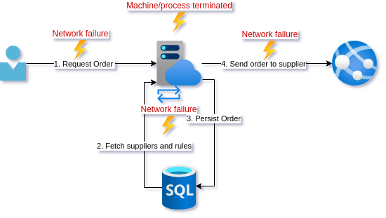
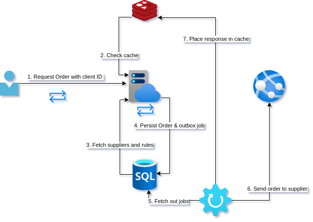

---
The [previous post](/reliable-apis-part-2) showed how things can go wrong when not thinking through edge cases carefully, especially where concurrency comes into play. In this post we will look at a truly idempotent endpoint design as well as discuss some alternative designs.
<!--more-->
Posts in this series:

1. [Exploring reties, retry implications, and the failure modes they are appropriate for](/reliable-apis-part-1)
2. [Using Idempotency-Key and a response cache](/reliable-apis-part-2)
3. The epic saga of client-side IDs and true idempotence

Once again we join our intrepid young developer as they try to implement a truly idempotent endpoint. They seek not idempotence for it's own sake but rather to finally claim that the endpoint is reliable.
As a reminder, this is the current design:

We have looked at all the different places this operation can fail in the two preceding posts. Currently, the DB calls are the only out-of-proc calls that have retry policies over them.

Our friend has not been idle during our absence. They have been leveling up knowledge on concurrency, REST, and architecture. The result is a design that is simple but our developer worries the team will think it unorthodox.

## A different perspective

After standup the team has a short sharing session on designs for the stories they are working on. You pitch the use of client generated IDs. Although not something the rest of the team has heard of, the name kind of gives it away, and the team balks at the idea. 

*"IDs should be generated on the server!"* Why? We already use UUIDs generated in our code. Does it matter where this is generated?  
*"It's a security risk!"* Why? It is internal software in our network where we maintain the client and the server.  
*"It seems weird!"* Why? From a REST point of view, we are just telling the server to create a resource at a more specific URI.

Let me explain further.

[](https://mermaid-js.github.io/mermaid-live-editor/edit/##eyJjb2RlIjoic2VxdWVuY2VEaWFncmFtXG4gICAgQ2xpZW50LT4-K0FQSTogQ3JlYXRlIG9yZGVyIHJlcXVlc3Qgd2l0aCBJZFxuICAgIEFQSS0-PkRCIDogRmV0Y2ggc3VwcGxpZXIgaW5mb1xuICAgIEFQSS0-PkRCIDogUGVyc2lzdCByZWNvcmQgd2l0aCBJZCBhbmQgb3V0Ym94XG4gICAgQVBJLS0-Pi1DbGllbnQ6IE9yZGVyIGNyZWF0ZWQgcmVzcG9uc2VcbiAgICBXb3JrZXItPj5EQiA6IEZldGNoIG91dGJveFxuICAgIFdvcmtlci0-PlN1cHBsaWVyIEFQSSA6IFNlbmQgb3JkZXJcbiAgICBXb3JrZXItPj5EQiA6IFVwZGF0ZSBvdXRib3hcbiAgICBsb29wIFBvbGwgZW5kcG9pblxuICAgICAgICBDbGllbnQtPj5BUEk6IENoZWNrIGlmIG9yZGVyIGNyZWF0aW9uIGRvbmVcbiAgICBlbmQiLCJtZXJtYWlkIjoie1xuICBcInRoZW1lXCI6IFwiZGVmYXVsdFwiXG59IiwidXBkYXRlRWRpdG9yIjpmYWxzZSwiYXV0b1N5bmMiOnRydWUsInVwZGF0ZURpYWdyYW0iOmZhbHNlfQ)

1. The client will generate a UUID as an identifier (ID) that will represent the Order to be created
2. Instead of sending `Idempotency-Key` we POST to a unique URI now eg. `/orders/1b2e680a-78ce-41f3-8296-63706432f844`. Now we either have a order at a known resource, or we do not.
3. When persisting this order, we use the ID sent as a unique identifier in the database. We can use the database to enforce uniqueness so any call to persist an order with the same ID will fail. If the persist was successful, we return `202 Accepted`.
4. Have a `supplier_requests` table that represent the [intent](https://devonburriss.me/reliability-with-intents/) to send the request to the supplier. This is the [outbox pattern](https://microservices.io/patterns/data/transactional-outbox.html).
5. A worker is running in the background that picks up and sends the unsent records from `supplier_requests`
6. Once the worker has completed, it updates the database such that subsequent GET requests to `/orders/1b2e680a-78ce-41f3-8296-63706432f844` will return `200 OK` instead of `202 Accepted`.

Although the unorthodoxy of generating the ID on the client side seems to bother some people in the team still, they can't really say why. More importantly, everyone agrees that this design does indeed seem to have the guarantees for resilience that they were aiming at.

Happy with the design and the buy-in, our developer pairs up with one of the more skeptical team members to implement the design. And finally, they can enable the client retry policies.

## Analysis

As part of the analysis we will go into some implementation details, as well as some possible alternative designs.

### Client-generated ID vs. Idempotency-Key

If a team is uncomfortable using the client-generated ID, continuing to use `Idempotency-Key` is a perfectly good solution. In this case you could just insert `Idempotency-Key` into another table in the same transaction as the order is inserted into the database. It is important that this is in the same transaction, or you lose the idempotency guarantee. You just need to make sure the column has a uniqueness constraint on it.

> A note on the primary key: When using client-generated ID you need not use it as the primary key for the Order. By indexing it and placing a uniqueness constraint on it we can use it as a public lookup. We can then use a database incrementing numeric key for the primary key to do joins on. This way your primary key is never exposed. This gives location independence if you needed to make major changes to your database to cope with scale.

### Outbox states

I wanted to make a few suggestions for your `supplier_requests` implementation. In my [intents](https://devonburriss.me/reliability-with-intents/) post I discuss a more generic outbox but I would not make that jump unless you have a lot of different systems you are interacting with in an application. 

Some data to consider keeping on the outbox:

- `created_at`
- `last_touch`
- `completed_at`
- `status`
- `try_count`
- `message`
- `order_id`

A few states to keep track of though:

- `pending`: Has not been picked up by a worker (message relay), Sets `created_at` & `last_touch` column to same value.
- `in-progress`: Has been picked up by a worked but not completed. Updates `last_touch` column.
- `failed`: Tried to post to the supplier but either failed with a reason that makes retying risky, or retry count was hit. Updates `try_count`, `message`, `completed_at`.
- `completed`: Set if POST to supplier is successful. Updates `try_count`, `completed_at`.

This design assumes all data you need can be fetched from the linked order. The other option is to just keep a serialized payload in the outbox row as a column.

### Workers

The workers that do the actual sending, known as *message relays*, need to be singletons so they are not picking up the same outbox message concurrently. This does not mean you can have only one. You could use locking, or more preferable, partitioning where multiple workers process concurrently but over distinct partitions. As a single example you could have 2 workers, 1 processing the outbox for orders with even numbered row number while the other processes odd.

### A word on cache back-channeling

For endpoints where multiple hits to either the POST (unlikely) or the GET (more likely) are going to cause significant load on the database, it can be a good idea to actively populate the cache. This is where the outbox represents the [intent](https://devonburriss.me/reliability-with-intents/) of steps in a saga rather than the mere passing on of a single message.

If for example we expected a high load on `GET /orders/1b2e680a-78ce-41f3-8296-63706432f844` our worker could:

1. POST to supplier API
2. Prepopulate a distributed cache with the order (or response, depending on cache type)
3. The unhappy path would be to trigger some sort of rollback or user notification of a failure to complete

### Optimization warning

If it is imperative that the endpoint be responding as quickly as possible that the saga has completed, you may be tempted to TRY complete it with the initial request. This gets us back into the concurrency problem where you could have the worker and the API both trying to process the same outbox message. It is possible if you are doing some locking on the database but honestly it just doesn't seem worth it to me.

## Conclusion

It took a while to get there, but our young developer finally got to a robust API design. In this series we looked at a few subtle ways that things can go wrong. These failure modes are often overlooked when developers are used to dealing with low volume loads, but can quickly become an issue if your load grows quickly. We also saw how sometimes business processes can mask system errors and so saw the importance of having good monitoring, metrics, and alerts fo not just the health, but proper operating of our systems.

The solutions presented in this post assume certain properties from your persistent storage, so it is important to think about how you are handling idempotence when selecting your database technology.

Finally, this design was really optimizing for resilience and eventual consistency of the system. Sometimes if speed of processing is more important, you may need to sacrifice some reliability. Unfortunately, when you are making those kinds of tradeoffs you are almost by definition dealing with high loads so... it depends.

## Summary

**Problem:** Duplicate calls

**Solutions:** idempotency via unique key in an atomic commit

**Consequence:** The database enforces no duplicates

## Resources

- [A very basic discussion of client vs. server IDs](https://www.techyourchance.com/client-generated-ids-vs-server-generated-ids/)
- [Flexible design for outbox like saga](https://devonburriss.me/reliability-with-intents/)
- [Interesting discussion of what happens when you can't use client side IDs](https://tech.trello.com/sync-two-id-problem/)

