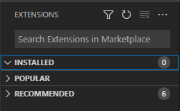
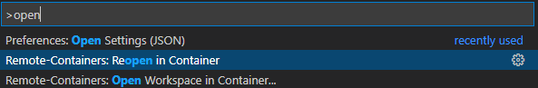
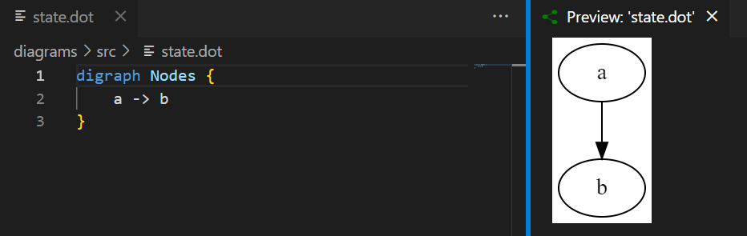
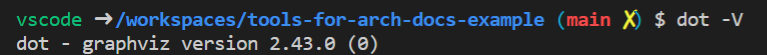
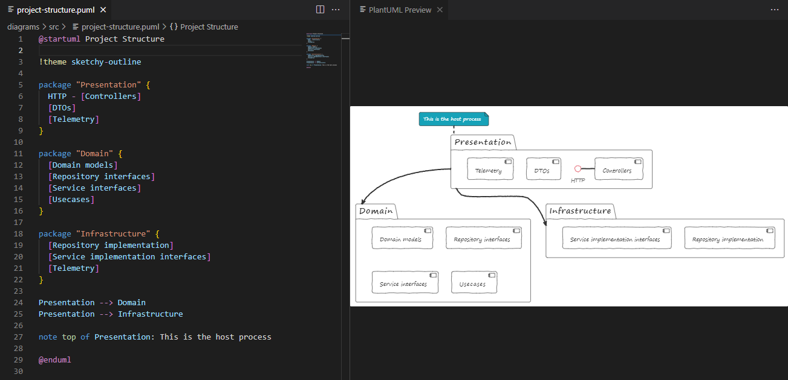
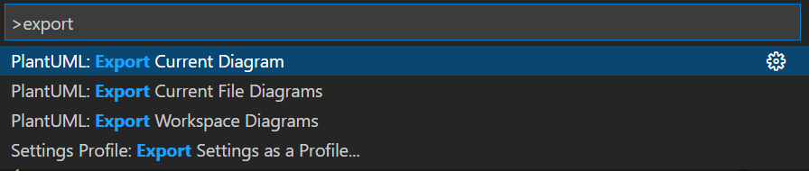
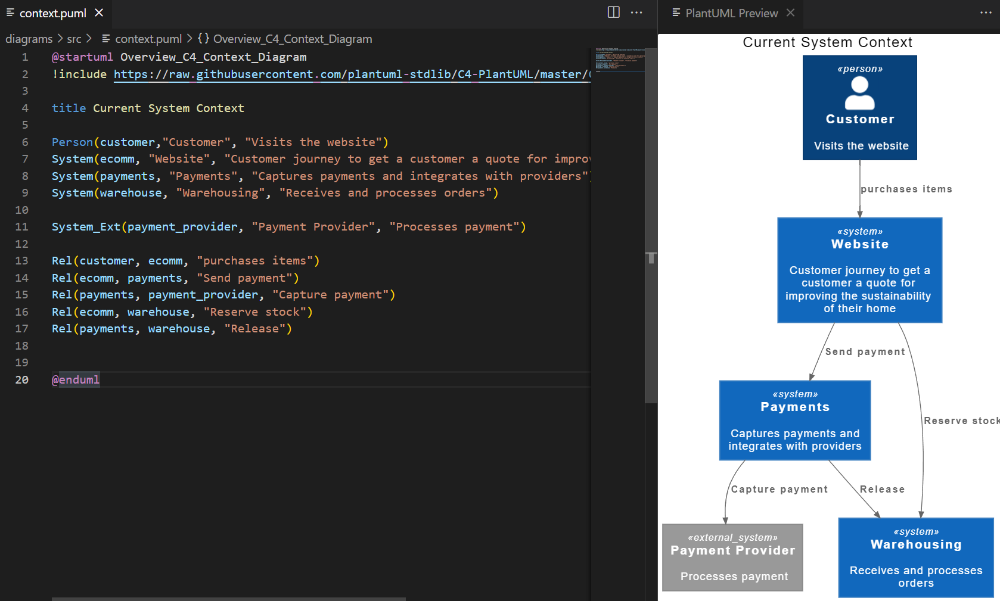
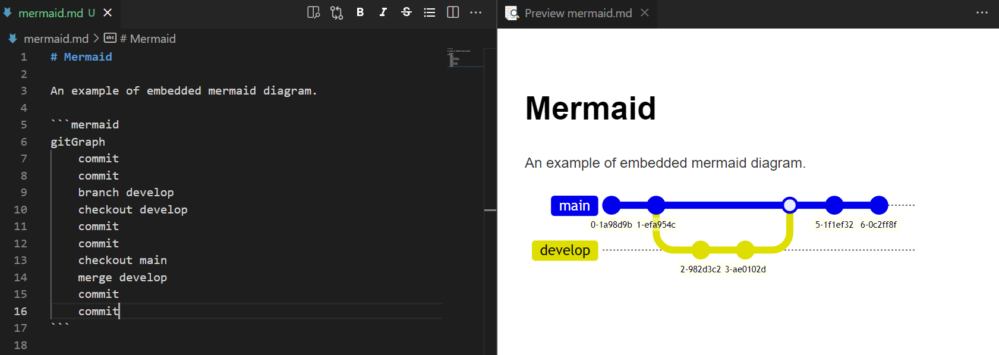
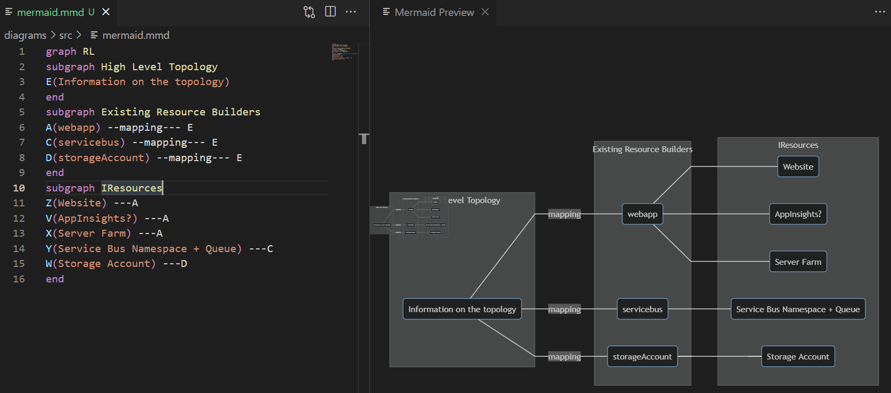
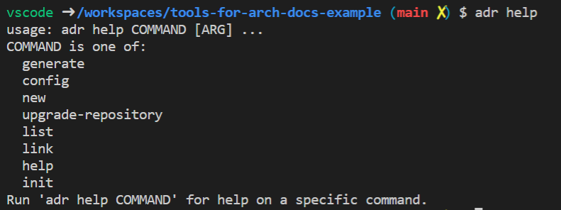

Keeping documentation up to date can be difficult, and an extra barrier can be if you need extra tools setup "just so" to contribute to the docs. In this post I will give a quick run-through of setting up a **[devcontainer](https://code.visualstudio.com/docs/remote/create-dev-container)** to help with great markdown editing, PlantUML, C4, and Mermaid diagrams. Another part of the documentation is the use of Architecture Decision Records, which will also be supported by the **devcontainer**.
<!--more-->
I recently setup a devcontainer for out "Patterns and Practices" repository at work. This makes it easy for a developer to jump in and contribute without needing to install the required tools.

In this post I won't be diving into the details of setting up a devcontainer. Instead I will show you what the container setup gives you and then point you toward where you can get it. I will callout the parts of the setup as I demo their results.

This setup uses the following tools:

- [VS Code](https://code.visualstudio.com/docs)
- [Graphviz](https://graphviz.org/)
- [PlatUML](https://plantuml.com)
- [C4](https://c4model.com/)
- [Mermaid](https://mermaid-js.github.io/)
- [ADR Tool](https://github.com/npryce/adr-tools/blob/master/INSTALL.md)

This will not be a thorough examination of each tool, although I will at least motivate why they are on the list. 

## Local setup

I will be starting with a clean VS Code setup to show that the devcontainer is doing all the work.



So the first things we need to do is make sure that you VS Code is ready to run a dev container:

- Make sure you have [Docker](https://www.docker.com/) installed
- Install the Remote - Containers extension


That's it! Your VC Code is now ready to run a devcontainer.

## Getting the devcontainer

The example repository can be found at [https://github.com/dburriss/tools-for-arch-docs-example](https://github.com/dburriss/tools-for-arch-docs-example). Either clone this or copy the *.vscode* and *.devcontainer* folders into the folder where you will be storing your markdown documentation.

It should prompt you to open in the container but if not bring up the command pallette and choose "Reopen in Container".



Next let's look at the various diagrams available to us.

## Graphviz

[Graphviz](https://graphviz.org/) is a fairly low-level drawing language (compared to other diagrams shown later). It uses .dot files to define diagrams.

Hit *Ctrl-Shift-v* to see a preview.



Graphviz is really powerful and flexible and this is why PlatUML is actually built on top of it, which is why it is included in this list. Personally, I have not used it much for architecture drawings.

It can be useful to generate diagrams dynamically since it is on the command-line.



## PlantUML

The next diagram we will try out will be a [PlatUML](https://plantuml.com) diagram. PlatUML has been around for a while and so supports a wide variety of diagram types.

Pressing *Alt-d* will bring up the render of the PlantUML diagram.



Pulling up the command pallette with *ctrl-p* then *>* allows you to export.



Good to know you can control the expected source and output folders in the *.vscode/settings.json* file:

```json
"plantuml.diagramsRoot": "diagrams/src",
"plantuml.exportOutDir": "diagrams/out",
"plantuml.exportFormat": "png"
```

PlantUML is useful in the number of standard software diagram it supports. Check out the docs for a a complete list and usage.

## C4

[C4](https://c4model.com/) diagrams are my goto when I want to explore or change an existing system or plan a new one. The creator Simon Brown had the insight that architecture diagrams should be like maps, and maps have a certain zoom level (show globe vs. country vs. city) and type (topographic vs. political). C4 diagrams have 4 main levels: System context, Container (running applications), and Code. There are others but these are the main ones that give it it's name.

Since it leverages PlantUML, *Alt-d* will get you a preview.



I highly recommend diving into C4. It is a valuable framework for organizing and structural drawing architecture diagrams. I have even experimented with functional modeling and you can judge the result [here](https://devonburriss.me/functional-modeling/).

## Mermaid

[Mermaid](https://mermaid-js.github.io/) is the new kid on the block when it comes to software diagramming. It has some of the usual suspects like Sequence and Class diagrams but then has some new ones like User Journey and Gitgraph diagrams.

It also has some interesting tooling options like being able to embed into markdown via a link to the Mermaid site as well as support menus and links on elements. Of interest if you use GitHub to host markdown, they now [support Mermaid in their markdown](https://github.blog/2022-02-14-include-diagrams-markdown-files-mermaid/).



You can also have a standalone file, although I found this is a bit buggy.



I am interested to see what new diagrams Mermaid releases. Hopefully a C4 diagram set!

## Conclusion

There are a couple things in the repository I have not covered that you may be interested in:

### Architecture Decision Records



Useful for recording the history of significant decisions made for an application or system of applications. Warning: requires discipline from the team to log decisions.

### Markdown plugins

The Markdown Extension Pack comes with plenty of useful plugins for working with markdown from tables to emojis.

## Plugin docs

Here is the list of plugins included in this devcontainer.

- [Markdown Extension Pack](https://marketplace.visualstudio.com/items?itemName=bat67.markdown-extension-pack)
- [Graphviz (dot) language support](https://marketplace.visualstudio.com/items?itemName=joaompinto.vscode-graphviz)
- [PlantUML](https://marketplace.visualstudio.com/items?itemName=jebbs.plantuml)
- [Mermaid](https://marketplace.visualstudio.com/items?itemName=vstirbu.vscode-mermaid-preview)
