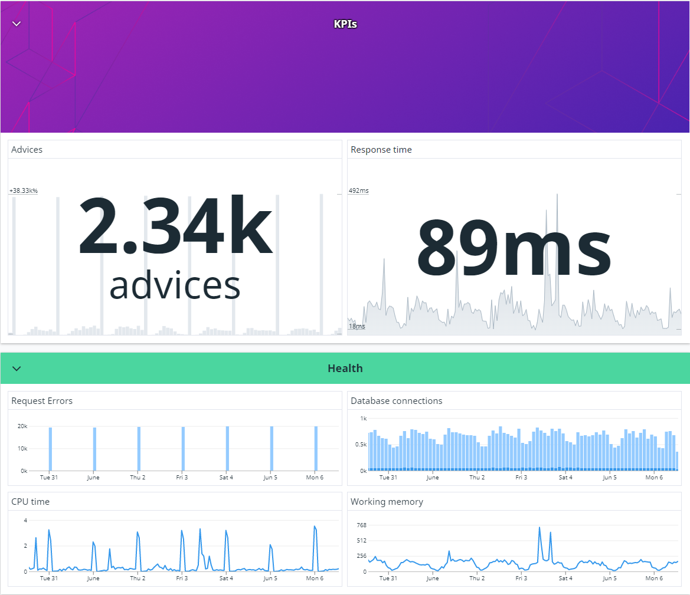

---
Recently we decided to make the switch from using Azure Application Insights as our primary telemetry monitoring tool, to [Datadog](https://docs.datadoghq.com/). I wanted to drop a few thoughts on why this was a good choice so anyone else looking to make this decision could take a few more aspects into consideration.
<!--more-->

When choosing a new tool, it is easy to get get caught up in the technical requirements. Don't get me wrong, these are VERY important and it is important to do your homework. There is nothing worse that choosing a tool and then only noticing afterward it had a huge gap in functionality.

For us some of the broad technical requirements were:

- Good integration with Azure
- Web App Service monitoring
- MS SQL monitoring
- Support for OpenTelemetry tracing
- Integrated logging and custom metrics
- Security alerting
- Alerting and integrations ie. Slack, PagerDuty, etc.

The things is, we were using Application Insights, and it does tick all of these boxes. So why change?

I can summarize it with this statement.

> A tool is useless if no-one wants to use it!

Let me phrase it another way. To get adoption of any tool or practice (monitoring is both), the best thing you can do is make it easy and immediately beneficial.

I have been at at least 3 companies where Datadog has been introduced. What I have noticed is that before its introduction teams do not often build dashboards, and so teams do not use dashboards. Why? Well in most tools, dashboards are complicated to make, don't look great, and often don't have all the needed data. To be fair, not all of this is because it cannot be done. It doesn't help if the tool always feels like it is getting in the way.

## A dashboard challenge

I decided to create 2 similar dashboards in both Datadog and Application Insights. The idea was to create a basic application dashboard that gave some high level overview and then a dive into some health metrics.

### Datadog Dashboard

The following dashboard took me 10 minutes to design and build with no prior knowledge of what I wanted on the board, or what metrics I would use.

### Application Insights Dashboard

The Application Insights dashboard took me just over 15 minutes to create, with idea being of following the same or similar design use on the Datadog one.

## Alerts

Alerts are a similar story to dashboards. With Datadog it is a single screen that is clearly arranged with all available metrics across all environments at your finger tips.

In Application Insights it is this weird process of refining the scope for the metrics you want to alert on.

And this refining with the hope of finding your metric later in your choice continues when setting up conditions.

Once you get to it setting up the condition is fairly intuitive.

### Critique of the experience

Datadog allows you to explore the metrics data and resulting graph or alert in real time. This makes for an interactive experience that allows you to learn what is possible while experimenting with different types of visualizations and queries. It also enables the quick creation of graphs and easy tweaking of data for better insights.

In contrast, Application Insights really makes you decide on your design upfront. A change usually means deleting a graph and choosing a new tile type or alert. Editing the graph requires changing between different modes and saving in a way that is really unintuitive. Lastly, and the most costly, is the fact that instead of just searching for metrics, you have to choose upfront whether you want metrics from a service, database, AI instance, etc. before being able to explore what metrics are available. Each time you need to pick a resource you need to drill down from the subscription/resource group/ resource layer in a tedious and time consuming way.

Alerts follow the same trend.

## Conclusion

I am in no way affiliated with Datadog. I am clearly a fan of the product though. I have seen it succeed many times in raising the level of monitoring in a company. I think this is in no small part due to its excellent UI and the way it lets a user explore what is possible. One great thing not mentioned is that the types of products available in the Datadog suite is ever growing and the integration that they have with each other is great. This does also bring up one point to keep in mind. With Datadog becoming a 1 stop shop for metrics, APM, logging, security, etc. it can be overwhelming. I suggest starting with one or two and expanding slowly. So do you find yourself in the position where you wish you had a better handle on not only the errors in your system but also what normal behaviour looks like? Maybe you need to ask whether your tooling is holding you back...

