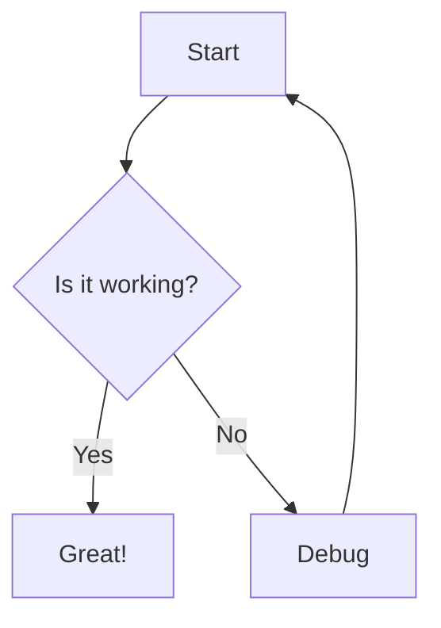
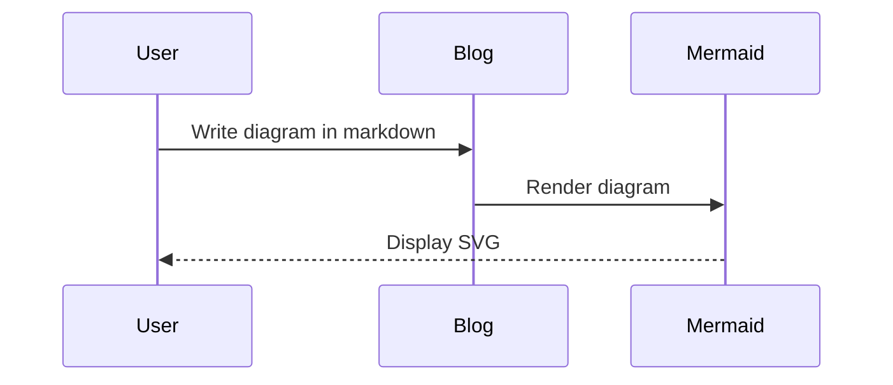
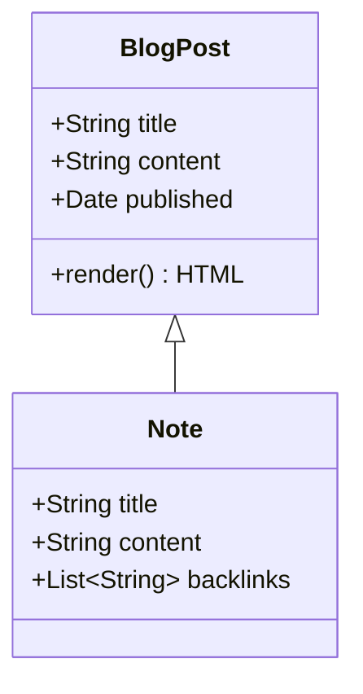

# Mermaid Diagram Implementation Guide

This document provides implementation-oriented guidance for adding Mermaid diagram support to the F# blog using Markdig's built-in Diagrams extension.

## Summary

Markdig (v0.31.0+) includes built-in support for diagram code blocks. This extension converts `mermaid` fenced code blocks to `<pre class="mermaid">` elements. We need to add client-side Mermaid.js to render these elements as SVG diagrams.

## Architecture Overview

```
Markdown Input          Markdig Processing       HTML Output           Client-Side Rendering
─────────────          ─────────────────       ────────────          ─────────────────────
```mermaid      ───►   Diagrams Extension  ───► <pre class="mermaid"> ───► Mermaid.js ───► SVG
graph TD                recognizes mermaid      ...diagram source...       renders diagram
  A-->B                 code blocks             </pre>
```
```

## Current State Analysis

### Existing Infrastructure
- **Markdig Version**: 0.31.0 (already supports Diagrams extension)
- **Markdown Pipeline**: Two-phase processing with custom WikiLink extension
- **Theme System**: Dark/light theme switching via `data-theme` attribute
- **JavaScript Loading**: Conditional loading pattern (e.g., highlight.js)

### Required Changes
1. Enable Markdig's Diagrams extension in the pipeline
2. Add Mermaid.js library (client-side)
3. Create theme-aware initialization script
4. Add CSS for diagram containers
5. Update layouts for conditional script loading

## Implementation Steps

### Step 1: Enable Diagrams Extension

**File**: `src/SiteRenderer/Parsing.fs`

Update both markdown pipelines to include the Diagrams extension:

```fsharp
// Line ~233 - Default pipeline
let markdownPipeline =
    MarkdownPipelineBuilder()
        .UseAdvancedExtensions()
        .UsePipeTables()
        .UseYamlFrontMatter()
        .UseWikiLinks()
        .UseDiagrams()  // Add this
        .Build()

// Line ~240 - Context-aware pipeline
let createContextAwarePipeline (resolutionContext: ResolutionContext option) =
    match resolutionContext with
    | Some context ->
        MarkdownPipelineBuilder()
            .UsePipeTables()
            .UseYamlFrontMatter()
            .UseWikiLinks(context)
            .UseDiagrams()  // Add this
            .UseEmphasisExtras()
            // ... rest of extensions
```

### Step 2: Add Mermaid.js Library

1. Download Mermaid.js (latest v10.x): https://unpkg.com/mermaid/dist/mermaid.min.js
2. Place in: `js/vendor/mermaid.min.js`
3. Copy to output during build (update `Renderer.fs` if needed)

### Step 3: Create Initialization Script

**File**: `js/mermaid-init.js`

```javascript
(() => {
  // Only run if Mermaid is loaded and there are diagrams to render
  if (typeof mermaid === 'undefined') return;
  
  const diagrams = document.querySelectorAll('.mermaid');
  if (diagrams.length === 0) return;
  
  // Initialize with theme support
  function initMermaid() {
    const theme = document.documentElement.dataset.theme || 'light';
    
    mermaid.initialize({
      startOnLoad: false,
      theme: theme === 'dark' ? 'dark' : 'default',
      themeVariables: {
        primaryColor: theme === 'dark' ? '#bb86fc' : '#6200ee',
        primaryTextColor: theme === 'dark' ? '#fff' : '#000',
        primaryBorderColor: theme === 'dark' ? '#bb86fc' : '#6200ee',
        lineColor: theme === 'dark' ? '#5e5e5e' : '#333',
        secondaryColor: theme === 'dark' ? '#03dac6' : '#018786',
        tertiaryColor: theme === 'dark' ? '#cf6679' : '#b00020',
        background: 'transparent',
        mainBkg: theme === 'dark' ? '#1e1e1e' : '#fff',
        secondBkg: theme === 'dark' ? '#2d2d2d' : '#f5f5f5',
        tertiaryBkg: theme === 'dark' ? '#3d3d3d' : '#e1e1e1',
        darkMode: theme === 'dark'
      },
      securityLevel: 'loose',
      fontFamily: 'var(--font-family, monospace)'
    });
    
    // Clear previous renders and re-render all diagrams
    diagrams.forEach(el => {
      el.removeAttribute('data-processed');
      el.textContent = el.textContent; // Reset content
    });
    
    mermaid.run({
      querySelector: '.mermaid'
    });
  }
  
  // Initialize on DOM ready
  if (document.readyState === 'loading') {
    document.addEventListener('DOMContentLoaded', initMermaid);
  } else {
    initMermaid();
  }
  
  // Re-render when theme changes
  const observer = new MutationObserver((mutations) => {
    mutations.forEach((mutation) => {
      if (mutation.type === 'attributes' && mutation.attributeName === 'data-theme') {
        initMermaid();
      }
    });
  });
  
  observer.observe(document.documentElement, {
    attributes: true,
    attributeFilter: ['data-theme']
  });
})();
```

### Step 4: Add CSS Styles

**File**: `css/site.css`

Add these styles to handle diagram rendering states:

```css
/* Mermaid diagram containers */
.mermaid {
  text-align: center;
  margin: 2em 0;
  overflow-x: auto;
}

/* Hide raw source while Mermaid processes */
.mermaid:not([data-processed="true"]) {
  font-family: var(--font-mono, monospace);
  white-space: pre;
  background-color: var(--surface-color, #f5f5f5);
  padding: 1em;
  border-radius: 0.5em;
  opacity: 0.5;
}

/* Dark mode adjustments */
html[data-theme="dark"] .mermaid:not([data-processed="true"]) {
  background-color: var(--surface-color, #2d2d2d);
}

/* Ensure SVG respects container */
.mermaid svg {
  max-width: 100%;
  height: auto;
}

/* Error state */
.mermaid-error {
  color: var(--error-color, #b00020);
  background-color: var(--error-bg, #ffebee);
  padding: 1em;
  border-radius: 0.5em;
  font-family: var(--font-mono, monospace);
}

html[data-theme="dark"] .mermaid-error {
  color: var(--error-color, #cf6679);
  background-color: var(--error-bg, #3d2c2c);
}
```

### Step 5: Update Layouts for Conditional Loading

**File**: `src/SiteRenderer/Layouts.fs`

Add Mermaid detection and conditional loading:

```fsharp
// Add after line ~180 (in scriptNode function)
let mermaidScripts =
    // Check if content contains mermaid diagrams
    if htmlContent.Contains("class=\"mermaid\"") then
        [ script [ _src (assetUrl site "js/vendor/mermaid.min.js") ] []
          script [ _src (assetUrl site "js/mermaid-init.js") ] [] ]
    else
        []

// Include in the script section of the layout
// (add to existing script list around line ~211)
yield! mermaidScripts
```

### Step 6: File Copying Updates

**File**: `src/SiteRenderer/Renderer.fs`

Ensure new JavaScript files are copied to output:

```fsharp
// In copyStaticAssets function (around line 800)
// Add to JavaScript file copying:
"js/vendor/mermaid.min.js"
"js/mermaid-init.js"
```

## Usage Examples

Once implemented, users can add Mermaid diagrams to posts, pages, and notes:

### Flow Chart
```markdown

```

### Sequence Diagram
```markdown

```

### Class Diagram
```markdown

```

## Testing Strategy

### Unit Tests
1. Test that Markdig correctly converts mermaid blocks to `<pre class="mermaid">`
2. Test that other code blocks remain unchanged

### Integration Tests
1. Create test content with various diagram types
2. Verify HTML output structure
3. Test theme switching behavior

### Manual Testing Checklist
- [ ] Diagrams render in posts
- [ ] Diagrams render in pages  
- [ ] Diagrams render in notes
- [ ] Theme switching updates diagram colors
- [ ] Invalid syntax shows graceful error
- [ ] Page without diagrams doesn't load Mermaid.js
- [ ] Multiple diagrams on one page work correctly

## Performance Considerations

1. **Library Size**: Mermaid.js is ~500KB minified
   - Only loaded on pages with diagrams
   - Consider CDN with local fallback for better caching

2. **Rendering Performance**
   - Diagrams render after page load
   - Large diagrams may cause layout shift
   - Consider placeholder sizing based on content

3. **Build Performance**
   - No impact - diagrams processed client-side
   - HTML generation remains fast

## Security Considerations

Mermaid.js evaluates diagram definitions which could potentially execute scripts. Mitigations:
1. Set `securityLevel: 'strict'` in Mermaid config (blocks HTML in labels)
2. Only process diagrams from trusted content
3. Consider Content Security Policy headers

## Future Enhancements

1. **Server-Side Rendering**
   - Pre-render diagrams during build for better SEO
   - Requires Node.js or headless browser in build pipeline

2. **Additional Diagram Types**
   - Enable Nomnoml support (already in Markdig)
   - Add PlantUML via external service

3. **Caching**
   - Cache rendered SVGs in localStorage
   - Detect unchanged diagrams to skip re-rendering

4. **Accessibility**
   - Add ARIA labels to diagrams
   - Provide text alternatives for complex diagrams

## Troubleshooting

### Common Issues

1. **Diagrams not rendering**
   - Check browser console for Mermaid errors
   - Verify Mermaid.js loaded successfully
   - Check diagram syntax

2. **Theme not applying**
   - Ensure initialization runs after theme change
   - Check theme variables are correctly set

3. **Layout shifts**
   - Add min-height to `.mermaid` containers
   - Consider skeleton loading state

### Debug Mode

Add to `mermaid-init.js` for debugging:
```javascript
mermaid.initialize({
  // ... other config
  logLevel: 'debug' // or 'info', 'warn', 'error'
});
```

## References

- [Markdig Diagrams Extension](https://github.com/xoofx/markdig/blob/master/src/Markdig.Tests/Specs/DiagramsSpecs.md)
- [Mermaid.js Documentation](https://mermaid.js.org/intro/)
- [Mermaid Live Editor](https://mermaid.live/) - Test diagram syntax
- [Mermaid Theming](https://mermaid.js.org/config/theming.html)