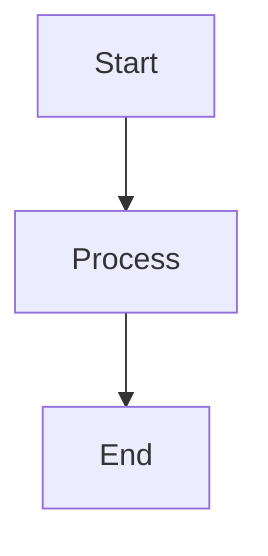

# markdown-diagrams Specification

## Purpose
TBD - created by archiving change add-mermaid-diagrams. Update Purpose after archive.
## Requirements
### Requirement: Mermaid Code Block Processing
The system SHALL convert mermaid code blocks in markdown to HTML elements suitable for client-side rendering.

#### Scenario: Basic flowchart processing
**Given** a markdown document contains:
```markdown

```
**When** the document is processed through the markdown pipeline
**Then** the HTML output SHALL contain `<pre class="mermaid">graph TD\n    A[Start] --> B[Process]\n    B --> C[End]</pre>`
**And** other code blocks SHALL remain unchanged

#### Scenario: Complex diagram with special characters  
**Given** a markdown document contains a mermaid diagram with quotes, colons, and line breaks
**When** the document is processed
**Then** the diagram source SHALL be preserved exactly in the HTML `<pre>` element
**And** special characters SHALL NOT be HTML-encoded within the mermaid block

### Requirement: Client-Side Diagram Rendering
The system SHALL render mermaid HTML elements as SVG diagrams using the Mermaid.js library.

#### Scenario: Diagram rendering on page load
**Given** a page contains `<pre class="mermaid">` elements
**When** the page loads in the browser
**Then** each mermaid element SHALL be converted to an SVG diagram
**And** the original text source SHALL be replaced by the rendered SVG

#### Scenario: Multiple diagrams on one page
**Given** a page contains multiple `<pre class="mermaid">` elements
**When** the page loads
**Then** all mermaid elements SHALL be rendered as separate SVG diagrams
**And** each diagram SHALL render independently without interference

### Requirement: Theme Integration
Rendered diagrams SHALL adapt to the site's current theme (light/dark mode).

#### Scenario: Light theme diagram colors
**Given** the site is in light theme mode
**When** a diagram is rendered  
**Then** the diagram SHALL use light theme colors (dark text on light backgrounds)
**And** diagram elements SHALL use the primary color from the light theme palette

#### Scenario: Dark theme diagram colors  
**Given** the site is in dark theme mode
**When** a diagram is rendered
**Then** the diagram SHALL use dark theme colors (light text on dark backgrounds)  
**And** diagram elements SHALL use the primary color from the dark theme palette

#### Scenario: Theme switching updates diagrams
**Given** a page with rendered diagrams is displayed
**When** the user switches from light to dark theme (or vice versa)
**Then** all diagrams SHALL automatically re-render with the new theme colors
**And** the transition SHALL complete within 2 seconds

### Requirement: Performance Optimization  
The Mermaid.js library SHALL only load on pages that contain diagrams.

#### Scenario: Page without diagrams
**Given** a page contains no `<pre class="mermaid">` elements  
**When** the page loads
**Then** the Mermaid.js library SHALL NOT be loaded
**And** the page load time SHALL NOT be impacted by Mermaid assets

#### Scenario: Page with diagrams  
**Given** a page contains at least one `<pre class="mermaid">` element
**When** the page loads
**Then** the Mermaid.js library SHALL be loaded automatically
**And** diagram rendering SHALL begin after library initialization

### Requirement: Error Handling
The system SHALL handle invalid diagram syntax gracefully.

#### Scenario: Invalid mermaid syntax
**Given** a mermaid code block contains invalid syntax
**When** the diagram is rendered
**Then** an error message SHALL be displayed in place of the diagram  
**And** the error SHALL be styled consistently with the current theme
**And** the raw mermaid source SHALL remain visible for debugging

#### Scenario: Library load failure
**Given** the Mermaid.js library fails to load
**When** a page with diagrams is viewed
**Then** the raw mermaid source SHALL remain visible in the `<pre>` elements
**And** no JavaScript errors SHALL be thrown
**And** the page SHALL remain functional

### Requirement: Responsive Design
Rendered diagrams SHALL work correctly across different viewport sizes.

#### Scenario: Diagram on mobile viewport
**Given** a page with diagrams is viewed on a mobile device
**When** the diagram renders
**Then** the diagram SHALL scale appropriately to fit the viewport
**And** horizontal scrolling SHALL be available for wide diagrams
**And** the diagram SHALL remain readable and interactive

#### Scenario: SVG responsiveness
**Given** a rendered diagram is wider than its container
**When** displayed in any viewport
**Then** the SVG SHALL have `max-width: 100%` applied
**And** the aspect ratio SHALL be preserved during scaling

